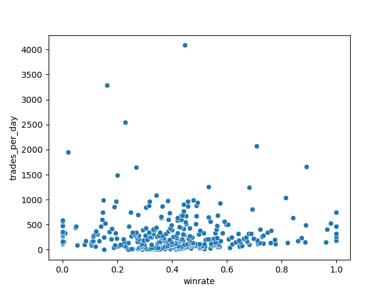
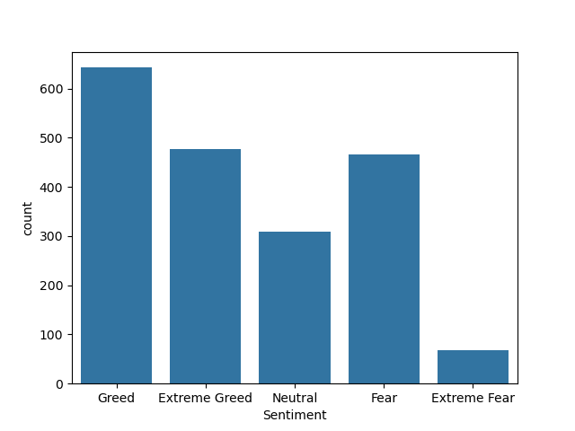
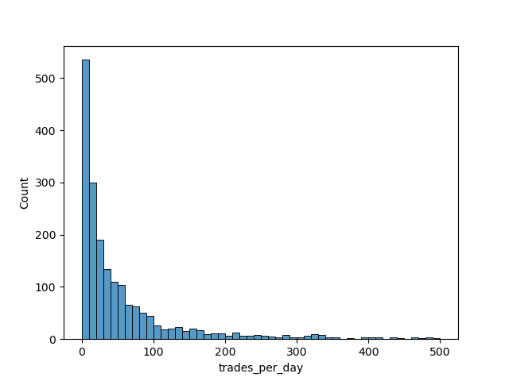
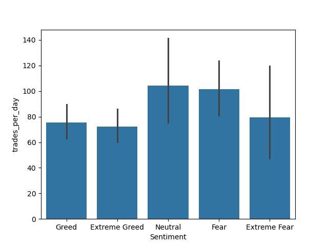
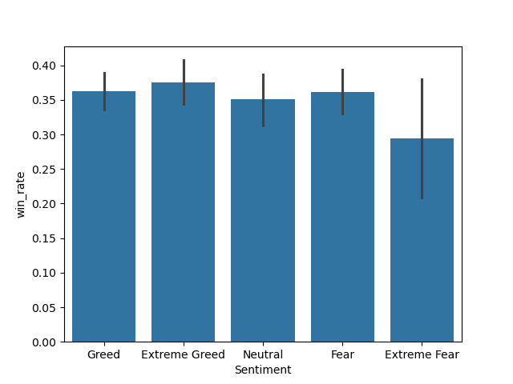
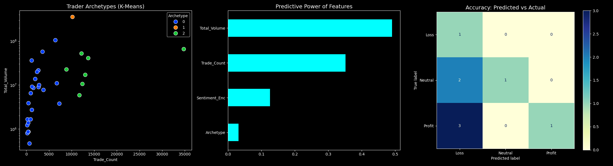

📊 Behavioral Trading Analysis: Sentiment & Performance EDA
This project explores the intersection of trader psychology (Sentiment) and execution performance (Win Rate, Volume, and Frequency). By analyzing trade logs, we identify behavioral archetypes and the correlation between emotional states and profitability.

🚀 Key Insights from EDA
# 1. Quality Over Quantity (Trades per Day vs. Win Rate)
Analysis of the relationship between trading frequency and success reveals a clear "Overtrading Trap":

<mark>**High-Precision Traders: Trades with a Win Rate > 0.8 are exclusively associated with low daily trade counts. This suggests that selective, patient trading leads to higher accuracy.**</mark>

The "Retail" Cluster: A massive volume of trades is concentrated in the 0.3 to 0.6 win rate range. Most market participants fall into this medium-win-rate, high-frequency category.

  

  
  

   
   
   

# 2. Emotional Drivers (Sentiment Distribution)
Sentiment data shows that "Greed" and "Fear" are the primary engines of market activity:

**Greed is the Catalyst: The Greed sentiment accounts for the highest number of trades, likely representing aggressive entries.**

**Fear as an Exit Strategy: Fear shows the second-highest volume. This high frequency during fearful periods likely indicates "panic closing" or defensive position management.**

Extreme Fatigue: "Extreme" sentiments (Extreme Fear/Greed) show significantly lower trade counts, suggesting that at emotional extremes, traders become paralyzed or "exhausted."
  

  
  

   
   
   

# 3. User Activity Distribution (Trades per Day Histogram)
The distribution of activity follows a power-law-like slope:

<mark>Core User Base: The majority of users perform between 0-50 trades per day.
</mark>

Progressive Decay: There is a sharp, progressive decrease in the number of users as the trades-per-day count increases. This indicates that the "High Frequency" segment is a small, specialized subset of the total population.

  
  

   
   
   

  
# 4. Sentiment-Based Volatility (Trades vs. Sentiment)
I analyzed the stability of trading behavior across different emotional states:

Neutrality is Active: Surprisingly,<mark> Neutral sentiment has the highest average trade count,</mark> though it carries a huge standard deviation, indicating inconsistent behavior.

Fearful Variance: Fear and Extreme Fear exhibit the largest standard deviations in trade counts. Under stress, trader behavior becomes highly unpredictable.

Greed is Stable: Conversely, Greed and Extreme Greed have lower standard deviations and lower overall trade counts compared to Neutral/Fear, suggesting more "calculated" or slower decision-making when optimistic.

  
  

   
   
   

# 5. Win Rate Consistency under Stress
How does emotion impact the likelihood of a win?

The Volatility of Fear: Extreme Fear produces the highest variance in performance, with win rates swinging between 0.20 and 0.40.

The Baseline: All other sentiments (Neutral, Greed, Fear) gravitate toward a stable average win rate of 0.35 with significantly lower standard deviation. This suggests that while most emotions don't drastically change the win rate, Extreme Fear creates the most inconsistent performance outcomes.

  
  

   
   
   

# 🛠 Tech Stack
Language: Python

Data Manipulation: Pandas, NumPy

Visualization: Matplotlib, Seaborn

🤖 Model Implementation Summary
This project employs a two-stage machine learning pipeline to turn raw trade logs into actionable behavioral insights.

## 1. Behavioral Clustering (Unsupervised)
We utilized K-Means Clustering to segment traders based on their execution rhythm (Volume vs. Frequency).

Model: sklearn.cluster.KMeans

Features: Total Trade Volume, Daily Trade Frequency.

Objective: Define "Trader Archetypes" (e.g., Scalpers, Whales, Retail).

## 2. Profitability Classification (Supervised)
A Random Forest Classifier was trained to predict the "Profitability Bucket" (Loss, Neutral, Profit) of each trader.

Model: sklearn.ensemble.RandomForestClassifier

Features: Sentiment Index, Trade Count, Total Volume, and Cluster ID.

Performance: Evaluated via Confusion Matrix and F1-Score metrics to ensure model robustness.

Machine Learning: Scikit-Learn (K-Means Clustering & Random Forest)

  
  

   
   
   

📂 Project Structure
To view csv you have to unzip the compressed files

Data_load_and_EDA.ipynb --->a IPYNB notebook file caontaining source code and works of Exploratory data analysis.
 
Model_training.ipynb    --->a another ipynb file containing works model training and data preprocessing.

joined_data.zip         --->data used for exploratory data analysis.

trainingdata.zip        --->data used for training the ML alogorithm.

[Folder](graphs_and_table) contains images and tables of EDA

[grouped_data_1](graphs_and_table/grouped_table.csv)

[grouped_data_1](graphs_and_table/grouped_data2.csv)

[grouped_data_3](graphs_and_table/grouped_data3.csv)
